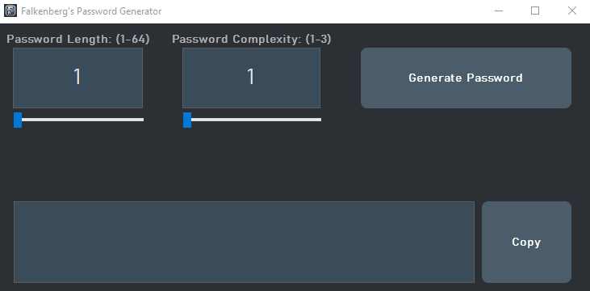

## Falkenberg's Password Generator

🎉 **Version 1.0 Release** 🎉

Welcome to the first release of **Falkenberg's Password Generator**, a standalone, secure, and easy-to-use tool designed to generate complex passwords with customizable options. This generator is a modular component of a larger password manager project currently in development.

### Features:
- **Customizable Complexity**: Choose from letters, numbers, and symbols to create the perfect password for your needs.
- **Dynamic Length Adjustment**: Easily adjust the password length with an intuitive slider.
- **Real-Time Feedback**: The password's font size adapts dynamically to its length for optimal readability.
- **Symbol Exclusion Options**: Exclude specific symbols from your password with simple checkboxes.
- **One-Click Copy**: Copy your generated password to the clipboard with a single click.

### Installation:
To make the installation process seamless, we've provided an installer in the release tab of this repository. Download and run the installer, and you'll be ready to generate secure passwords in no time!

### How It Works:
This application uses C++ and the Qt framework to create a user-friendly interface while ensuring robust password generation. Under the hood, it employs a random number generator to select characters based on the user's chosen settings, providing a truly random and secure password every time.

### What’s Next:
This password generator is just the beginning. Stay tuned for the full password manager, which will offer comprehensive features like password storage, encryption, and management—all while maintaining user control on the client-side.

### Contributing:
If you have any suggestions or find a bug, feel free to open an issue or submit a pull request. Contributions are always welcome!

